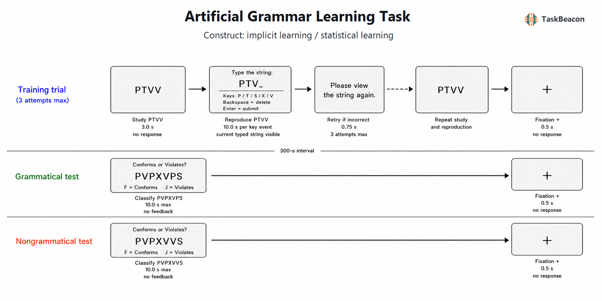

# 人工语法学习任务：序列规则内隐获得的实验逻辑、神经基础与测量边界

人工语法学习（artificial grammar learning, AGL）任务用于检验个体能否在未获知生成规则的条件下，从有限的符号序列样例中提取结构规律，并将所得知识迁移到未见序列。该范式将自然语言中彼此纠缠的语义、语用和既往经验暂时剥离，以受控的有限状态语法生成训练材料，再以新项目的合语法性判断测量学习结果。其核心方法学价值在于区分对训练项目的记忆与对未见项目的泛化；其主要困难则是，正确分类可能同时受到抽象结构、局部字母片段、整体相似性、显性规则和反应策略影响。因此，AGL 的高于机会水平表现可作为序列规律学习的证据，但不能在未经附加操控时等同于无意识的抽象语法获得。

## 1. 范式提出与理论背景

Reber（1967）以有限状态图生成字母串，要求参与者先记忆合语法样例，随后在告知存在复杂规则后判断新字母串是否符合该规则。参与者虽难以口头陈述生成规则，分类仍高于机会水平；“内隐学习”由此被操作化为在无学习意图、有限可报告知识条件下形成对结构的敏感性。该设计确立了“偶然获得—规则告知—新项目分类”的基本序列，也把研究问题从能否复述样例推进到能否迁移训练中未被明确教示的关系。

早期的抽象规则解释随后受到片段知识解释的修正。Perruchet 与 Pacteau（1990）指出，参与者可学习合法二元或三元片段，并据其熟悉性完成分类，无须表征完整状态转移规则。Knowlton 与 Squire（1994, 1996）进一步通过联结片段强度（associative chunk strength, ACS）操控表明，合语法性与训练片段相似性可分别影响接受率；遗忘症患者虽缺乏正常的陈述性记忆，仍可表现出分类学习和跨字母集迁移。上述结果支持程序性或非陈述性学习对任务成绩的贡献，但也说明 AGL 所获得的知识通常是抽象结构与样例特异信息的混合，而非单一形式的“规则”。

“内隐”还涉及知识是否可被意识访问，而不仅是训练阶段有没有告知规则。分类后口头报告可能低估零散、低置信度但可用的显性知识；置信度、猜测标准和规则觉察量表又分别测量判断知识的不同方面。实验显示，量表选择会改变对无意识知识比例的估计，且有意识与无意识知识可以共同支持同一次分类（Tunney & Shanks, 2003; Wierzchoń et al., 2012）。因而，偶然训练和“凭直觉作答”的指导语只能限制显性策略，不能单独证明所得表征处于意识之外。

## 2. 任务逻辑、流程与核心指标

经典 AGL 通常包含获得与测验两个阶段。获得阶段仅呈现由同一语法生成的序列，常要求记忆、抄写或即时再认，使参与者加工序列而不揭示生成规则。测验前才告知训练项目遵循规则，并要求对未见的合语法与不合语法项目作二择判断。主要指标是总准确率、合语法项目命中率、不合语法项目正确拒绝率和反应时；在存在反应偏向时，信号检测指标 *d′* 比原始正确率更能分离辨别力与“倾向接受”策略。

对比的可解释性取决于测验材料如何构造。不合语法项目若仅由合语法项目替换一个符号得到，违规位置和局部片段新颖性可能同时改变；若两类项目的长度、重复结构或 ACS 未平衡，“合语法 > 不合语法”的差异不能唯一归于状态转移知识。较强设计会正交操控合语法性与 ACS，使用训练中未出现的新序列，必要时更换表面符号集以检验关系迁移，并记录逐试次置信度或知识归因。训练项目的多样性同样重要：在总暴露量近似时，较多不重复样例比反复呈现少量样例更有利于泛化，提示样例覆盖范围会改变可学习的统计结构（Schiff et al., 2021）。

训练中的即时复述主要保障注意投入并提供序列记忆指标，不能直接替代分类测验。复述正确率受工作记忆、输入速度和运动执行影响；分类则同时包含结构敏感性、决策阈值及明确告知规则后的策略搜索。近期尝试以视觉序列回忆构成较少依赖反思的学习指标，但两项实验未在回忆指标上检出 AGL 效应，而传统判断任务仍显示学习，说明不同输出形式不一定测到同一知识（Jenkins et al., 2024）。

## 3. 主要行为与神经科学发现

### 3.1 行为证据与知识表征

群体水平上，高于机会水平的未见项目分类是较稳定的现象，但其信息来源具有异质性。平衡 ACS 的研究显示，参与者既对合语法性敏感，也对片段熟悉性敏感；跨符号集迁移说明学习不完全依赖具体字母，却不能排除位置模式、重复结构或更高阶片段的贡献（Knowlton & Squire, 1996）。Trotter 等（2020）对视觉和听觉 AGL 研究的元分析方案及初步结果同样提示，总体学习效应显著，但语法类型、呈现模态、训练量、测验构造和物种构成均可解释研究间变异，并存在发表偏倚迹象。由此，实验报告应同时呈现项目级属性与接受率，而不只报告总体准确率。

发展与临床研究进一步表明，任务成绩不是脱离材料和发展阶段的纯能力指标。8—12 岁发展性语言障碍儿童在视觉 AGL 中整体弱于典型发展儿童，且对合语法性的利用方式不同；小样本和组间一般认知差异限制了个体诊断解释（Gillis et al., 2022）。一项历时一年的研究发现，成人在视觉 AGL 中优于 7 岁儿童，但两组均能把规则推广到新刺激集并在一年后保留部分知识，未支持普遍的儿童学习优势（Schönberger et al., 2024）。年龄、读写经验、工作记忆、材料模态与训练剂量因此需要作为设计变量处理。

### 3.2 fMRI 与 EEG 证据

事件相关功能磁共振成像研究在平衡合语法性与 ACS 后发现，人工句法分类涉及额叶、扣带、顶叶、枕颞区及尾状核构成的分布式网络；左下额叶部分区域对语法违规的敏感性可与 ACS 效应区分，但 BOLD 差异仍可能包含结构整合困难、错误监测和决策控制（Forkstam et al., 2006）。近期坐标元分析将 25 项人工语法或相关统计学习影像研究归纳为左侧语言子网络及两个认知控制网络，支持规则识别、维持和应用依赖多网络协作，而不支持把 AGL 定位为单一脑区功能（Ramage et al., 2024）。该元分析纳入的语法类型和实验对比较宽，结论更适合描述共同网络，不能替代经典 Reber 版本的任务特异定位。

脑电图（electroencephalography, EEG）提供了违规加工的时间证据。在控制 ACS 并设置暴露前基线的研究中，训练后的不合语法序列引发中央—顶叶 P600 效应，而陌生局部片段未产生相同模式，支持晚期正波与已学结构违规加工相关（Silva et al., 2017）。视觉与听觉版本获得相近行为学习时，违规相关事件相关电位（event-related potential, ERP）的潜伏期和头皮分布仍不同，晚期效应则呈现若干共同性质（Silva et al., 2018）。这些结果符合“共同计算原则受模态特异网络实现”的解释；P600 也受重分析、注意和任务要求影响，头皮分布不能给出精确脑源，更不能证明自然语言句法与有限状态语法具有同一神经机制。

## 4. 范式发展与主要应用

AGL 已由静态字母串扩展到音节、形状、音调、动作序列和小型人工语言，用于比较视觉与听觉学习、局部与非局部依赖、关系迁移以及发展和临床差异。扩展增强了对语言学习和领域一般序列学习的联系，但也降低了不同研究间“同一任务”的同质性。有限状态字母串适合控制符号转移和表面统计，不包含自然语言中的语义组合、交流意图与丰富层级结构；从 AGL 成绩推论一般语言能力时，应说明被模拟的是序列规律提取或结构整合，而非完整语法习得。

在线实验工具使大样本、多语言和多设备研究更可行，同时引入显示时序、键盘延迟和测试环境不可控等误差。训练样例多样化、ACS 正交化、符号集迁移、暴露前基线及项目级混合效应模型，是近年来提高构念可识别性的主要方向。它们改变的是证据所能排除的替代解释，而不只是任务呈现形式。

## 5. 测量效度与解释边界

AGL 具有明确的实验效度：训练与测验材料可由同一生成系统控制，新项目分类可检验超越逐项记忆的泛化。然而，分类正确并不充分区分抽象规则、片段熟悉性、整体相似性和显性假设检验。内容效度取决于材料是否平衡长度、ACS、重复模式和违规位置；意识状态则需借助逐试次置信度、知识归因或敏感的规则测验另行评估。

稳定的群体学习效应也不保证可靠的个体排序。Erickson 等（2016）报告其 AGL 测量的重测相关约为 *r* = .31，且不同统计学习任务间相关性很弱；受限的个体差异范围、试次数、项目抽样和重测时的新学习均可能压低信度。AGL 更适合检验实验条件或群体均值差异；若用于个体差异、纵向预测或临床筛查，应增加测验项目、使用平行语法、建立项目反应或层级模型，并预先验证目标样本中的信度。未作这些处理时，单次正确率不宜解释为稳定的“内隐学习能力”。

## 6. TaskBeacon 中的任务实现

### 6.1 任务资源与访问入口

| 资源 | ID | 用途 | 地址 |
|---|---|---|---|
| 完整行为实验 | T000082 | PsychoPy/PsyFlow 本地运行、研究修改与数据采集 | [源码仓库](https://github.com/TaskBeacon/T000082-artificial-grammar-learning-task) |
| 浏览器行为版本 | H000082 | 与当前核心流程对齐的在线体验与网页数据采集 | [源码仓库](https://github.com/TaskBeacon/H000082-artificial-grammar-learning-task) |
| 公开运行入口 | H000082 | 共享 `psyflow-web` 中直接运行 | [运行任务](https://taskbeacon.github.io/psyflow-web/?task=H000082-artificial-grammar-learning-task) |

T、H 两个仓库均标记为行为采集版本；网页版本不应被表述为 EEG、fMRI 或临床采集实现。当前两者的训练次数、五分钟间隔和测试材料相同，但浏览器环境的显示与输入时序精度仍应独立评估。

### 6.2 实现流程与关键参数

TaskBeacon 当前版本采用经典 Reber 有限状态字母语法。训练池含 16 个由 P、T、S、X、V 构成的合语法串，每个项目以独立随机顺序呈现两遍，共 32 个逻辑试次。字母串呈现 3.0 s 后进入即时复述，参与者可用退格修改并以回车提交；错误项目最多再呈现两次，即每个项目最多三次尝试。训练不说明语法，也不提供语法规则反馈。300 s 注视间隔后，指导语揭示训练串遵循复杂规则，并要求以 F/J 键凭直觉判断新串是否合语法。

测试包含 16 个未训练合语法串及 16 个由其配对源串单字符替换形成的不合语法串，顺序随机，最长反应时间 10.0 s，试次后无正确性反馈，试次间隔为 0.5 s。实现未依据参与者表现自适应调整刺激或难度；调度仅保证训练池两次完整覆盖、训练与测试正例不重叠、两类测试项目等量以及违规位置记录。主要结果为总正确率、合语法命中率、不合语法正确拒绝率、分类反应时和训练复述表现。单字符违规同时可能改变局部片段熟悉性，当前材料未报告 ACS 的正交平衡，因而分类差异应解释为对既定训练统计结构的综合敏感性。

*图 1. TaskBeacon T000082 的试次与阶段流程。训练阶段中，16 个合语法 P/T/S/X/V 字母串各呈现两遍，每次先显示 3.0 s，再开放键盘即时复述；P/T/S/X/V 用于输入，退格删除、回车提交，错误时显示 0.75 s 的再次呈现提示并重试，单项目最多三次尝试，随后为 0.5 s 注视。300 s 注视间隔后进入分类阶段；16 个新合语法串与 16 个由配对合语法串单字符替换形成的违规串随机呈现，F 表示符合规则、J 表示不符合规则，反应窗为 10.0 s，无逐试次反馈，随后为 0.5 s 注视。任务不进行基于行为的难度自适应，随机调度仅维持两次训练覆盖、训练—测试正例分离和 1:1 测试平衡。*

## 参考文献

Erickson, L. C., Kaschak, M. P., Thiessen, E. D., & Berry, C. A. S. (2016). Individual differences in statistical learning: Conceptual and measurement issues. *Collabra, 2*(1), Article 14. https://doi.org/10.1525/collabra.41

Forkstam, C., Hagoort, P., Fernandez, G., Ingvar, M., & Petersson, K. M. (2006). Neural correlates of artificial syntactic structure classification. *NeuroImage, 32*(2), 956–967. https://doi.org/10.1016/j.neuroimage.2006.03.057

Gillis, J. U., Gul, A., Fox, A., Parikh, A., & Arbel, Y. (2022). Artificial grammar learning in children with developmental language disorder. *Journal of Speech, Language, and Hearing Research, 65*(1), 292–302. https://doi.org/10.1044/2021_JSLHR-21-00050

Jenkins, H. E., de Graaf, Y., Smith, F., Riches, N., & Wilson, B. (2024). Assessing serial recall as a measure of artificial grammar learning. *Frontiers in Psychology, 15*, Article 1497201. https://doi.org/10.3389/fpsyg.2024.1497201

Knowlton, B. J., & Squire, L. R. (1994). The information acquired during artificial grammar learning. *Journal of Experimental Psychology: Learning, Memory, and Cognition, 20*(1), 79–91. https://doi.org/10.1037/0278-7393.20.1.79

Knowlton, B. J., & Squire, L. R. (1996). Artificial grammar learning depends on implicit acquisition of both abstract and exemplar-specific information. *Journal of Experimental Psychology: Learning, Memory, and Cognition, 22*(1), 169–181. https://doi.org/10.1037/0278-7393.22.1.169

Perruchet, P., & Pacteau, C. (1990). Synthetic grammar learning: Implicit rule abstraction or explicit fragmentary knowledge? *Journal of Experimental Psychology: General, 119*(3), 264–275. https://doi.org/10.1037/0096-3445.119.3.264

Ramage, A. E., Cote, K., Thorson, J. C., Lerner, K., Reidel, M. C., & Laird, A. R. (2024). Elucidating a statistical learning brain network: Coordinate-based meta-analyses and functional connectivity profiles of artificial grammar learning in healthy adults. *Imaging Neuroscience, 2*, Article imag-2-00355. https://doi.org/10.1162/imag_a_00355

Reber, A. S. (1967). Implicit learning of artificial grammars. *Journal of Verbal Learning and Verbal Behavior, 6*(6), 855–863. https://doi.org/10.1016/S0022-5371(67)80149-X

Schiff, R., Ashkenazi, P., Kahta, S., & Sasson, A. (2021). Stimulus variation-based training enhances artificial grammar learning. *Acta Psychologica, 214*, Article 103252. https://doi.org/10.1016/j.actpsy.2021.103252

Schönberger, D. K., Bruns, P., & Röder, B. (2024). Visual artificial grammar learning across 1 year in 7-year-olds and adults. *Journal of Experimental Child Psychology, 241*, Article 105864. https://doi.org/10.1016/j.jecp.2024.105864

Silva, S., Folia, V., Hagoort, P., & Petersson, K. M. (2017). The P600 in implicit artificial grammar learning. *Cognitive Science, 41*(1), 137–157. https://doi.org/10.1111/cogs.12343

Silva, S., Folia, V., Inácio, F., Castro, S. L., & Petersson, K. M. (2018). Modality effects in implicit artificial grammar learning: An EEG study. *Brain Research, 1687*, 50–59. https://doi.org/10.1016/j.brainres.2018.02.020

Trotter, A. S., Monaghan, P., Beckers, G. J. L., & Christiansen, M. H. (2020). Exploring variation between artificial grammar learning experiments: Outlining a meta-analysis approach. *Topics in Cognitive Science, 12*(3), 875–893. https://doi.org/10.1111/tops.12454

Tunney, R. J., & Shanks, D. R. (2003). Subjective measures of awareness and implicit cognition. *Memory & Cognition, 31*(7), 1060–1071. https://doi.org/10.3758/BF03196127

Wierzchoń, M., Asanowicz, D., Paulewicz, B., & Cleeremans, A. (2012). Subjective measures of consciousness in artificial grammar learning task. *Consciousness and Cognition, 21*(3), 1141–1153. https://doi.org/10.1016/j.concog.2012.05.012
